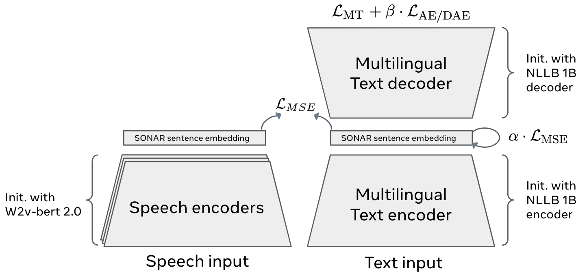
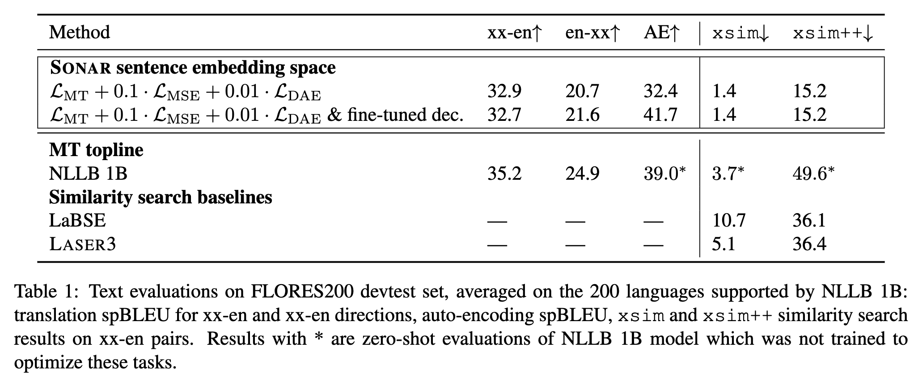
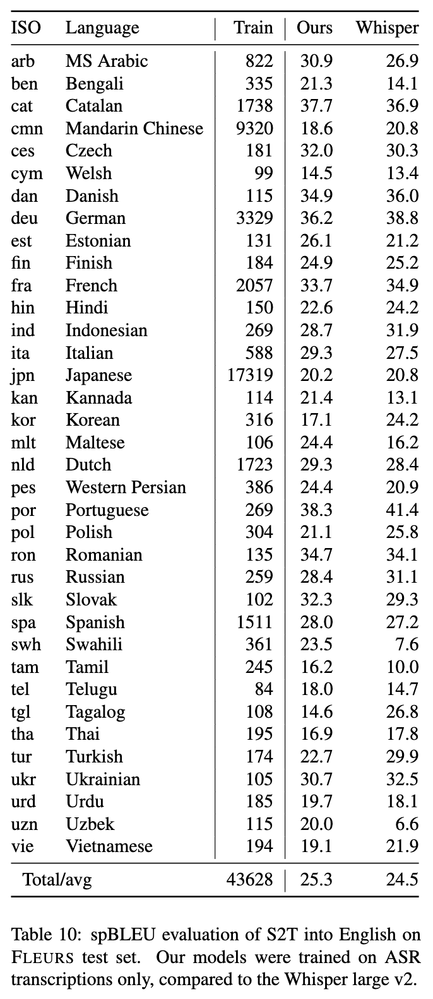

# SONAR
[[Paper]](https://ai.meta.com/research/publications/sonar-sentence-level-multimodal-and-language-agnostic-representations/)
[[Demo]](#usage)

We introduce SONAR, a new multilingual and multimodal fixed-size sentence embedding space, with a full suite of speech and text encoders and decoders. It substantially outperforms existing sentence embeddings such as LASER3 and LabSE on the xsim and xsim++ multilingual similarity search tasks. 

Speech segments can be embedded in the same SONAR embedding space using language-specific speech encoders trained in a teacher-student setting on speech transcription data. We also provide a single text decoder, which allows us to perform text-to-text and speech-to-text machine translation, including for zero-shot language and modality combinations.

*SONAR* stands for **S**entence-level multim**O**dal and la**N**guage-**A**gnostic **R**epresentations

The full list of supported languages (along with download links) can be found here [below](#supported-languages-and-download-links).

## SONAR Architecture:
<p align="center">
  <br />
</p>


## Text results
<p align="center">
  <br />
</p>

## Speech results
<p align="center">
  <br />
</p>


## Installing

You can install SONAR with `pip install sonar-space`. Note that there is another `sonar` package on pip that IS NOT this project, make sure to use `sonar-space` in your dependencies.

If you want to install SONAR manually, you can install it localy. SONAR depends mainly on [Fairseq2](https://github.com/facebookresearch/fairseq2) and can be installed using (tested with `python=3.8`)

```bash
pip install --upgrade pip
pip install -e .
```

If fairseq2 does not provide a build for your machine, check the readme of that project to build it locally.

## Usage
fairseq2 will automatically download models into your `$TORCH_HOME/hub` directory upon using the commands below.

### Compute text sentence embeddings with SONAR:
```python
from sonar.inference_pipelines.text import TextToEmbeddingModelPipeline
t2vec_model = TextToEmbeddingModelPipeline(encoder="text_sonar_basic_encoder",
                                           tokenizer="text_sonar_basic_encoder")
sentences = ['My name is SONAR.', 'I can embed the sentences into vectorial space.']
embeddings = t2vec_model.predict(sentences, source_lang="eng_Latn")
print(embeddings.shape)
# torch.Size([2, 1024])
```

### Reconstruct text from SONAR embeddings
```python
from sonar.inference_pipelines.text import EmbeddingToTextModelPipeline
vec2text_model = EmbeddingToTextModelPipeline(decoder="text_sonar_basic_decoder",
                                              tokenizer="text_sonar_basic_encoder")
reconstructed = vec2text_model.predict(embeddings, target_lang="eng_Latn", max_seq_len=512)
# max_seq_len is a keyword argument passed to the fairseq2 BeamSearchSeq2SeqGenerator.
print(reconstructed)
# ['My name is SONAR.', 'I can embed the sentences into vector space.']
```

### Translate text with SONAR
```python
from sonar.inference_pipelines.text import TextToTextModelPipeline
t2t_model = TextToTextModelPipeline(encoder="text_sonar_basic_encoder",
                                    decoder="text_sonar_basic_decoder",
                                    tokenizer="text_sonar_basic_encoder")  # tokenizer is attached to both encoder and decoder cards

sentences = ['My name is SONAR.', 'I can embed the sentences into vectorial space.']
t2t_model.predict(sentences, source_lang="eng_Latn", target_lang="fra_Latn")
# ['Mon nom est SONAR.', "Je peux intégrer les phrases dans l'espace vectoriel."]
```

### Compute speech sentence embeddings with SONAR
```python
from sonar.inference_pipelines.speech import SpeechToEmbeddingModelPipeline
s2vec_model = SpeechToEmbeddingModelPipeline(encoder="sonar_speech_encoder_eng")

s2vec_model.predict(["./tests/integration_tests/data/audio_files/audio_1.wav",
                     "./tests/integration_tests/data/audio_files/audio_2.wav"]).shape
# torch.Size([2, 1024])
import torchaudio
inp, sr = torchaudio.load("./tests/integration_tests/data/audio_files/audio_1.wav")
assert sr == 16000, "Sample rate should be 16kHz"

s2vec_model.predict([inp]).shape
# torch.Size([1, 1024])
```

### Speech-to-text translation with SONAR
```python
from sonar.inference_pipelines.speech import SpeechToTextModelPipeline

s2t_model = SpeechToTextModelPipeline(encoder="sonar_speech_encoder_eng",
                                      decoder="text_sonar_basic_decoder",
                                      tokenizer="text_sonar_basic_decoder")

import torchaudio
inp, sr = torchaudio.load("./tests/integration_tests/data/audio_files/audio_1.wav")
assert sr == 16000, "Sample rate should be 16kHz"

# passing loaded audio files
s2t_model.predict([inp], target_lang="eng_Latn")
# ['Television reports show white smoke coming from the plant.']

# passing multiple wav files 
s2t_model.predict(["./tests/integration_tests/data/audio_files/audio_1.wav",
                   "./tests/integration_tests/data/audio_files/audio_2.wav"], target_lang="eng_Latn")
# ['Television reports show white smoke coming from the plant.',
# 'These couples may choose to make an adoption plan for their baby.']
```


### Predicting sentence similarity with BLASER 2.0 models

BLASER 2.0 is a family of models for automatic evaluation of machine translation quality based on SONAR embeddings.
They predict [cross-lingual semantic similarity](https://github.com/facebookresearch/fairseq/tree/nllb/examples/nllb/human_XSTS_eval) 
between the translation and the source (optionally, also using a reference translation). 

```Python
from sonar.inference_pipelines.text import TextToEmbeddingModelPipeline
from sonar.models.blaser.loader import load_blaser_model

blaser_ref = load_blaser_model("blaser_2_0_ref").eval()
blaser_qe = load_blaser_model("blaser_2_0_qe").eval()
text_embedder = TextToEmbeddingModelPipeline(encoder="text_sonar_basic_encoder", tokenizer="text_sonar_basic_encoder")

src_embs = text_embedder.predict(["Le chat s'assit sur le tapis."], source_lang="fra_Latn")
ref_embs = text_embedder.predict(["The cat sat on the mat."], source_lang="eng_Latn")
mt_embs = text_embedder.predict(["The cat sat down on the carpet."], source_lang="eng_Latn")

print(blaser_ref(src=src_embs, ref=ref_embs, mt=mt_embs).item())  # 4.688
print(blaser_qe(src=src_embs, mt=mt_embs).item())  # 4.708
```

Detailed model cards with more examples: [facebook/blaser-2.0-ref](https://huggingface.co/facebook/blaser-2.0-ref), 
[facebook/blaser-2.0-qe](https://huggingface.co/facebook/blaser-2.0-qe). 

### Demo notebooks
See more complete demo notebooks :

* [sonar text2text similarity and translation](examples/sonar_text_demo.ipynb)
* [sonar speech2text and other data pipeline examples](examples/inference_pipelines.ipynb)


## Supported languages and download links
The SONAR text encoder & decoder supports 200 languages. SONAR speech encoders support 37 languages.

<details>
<summary>Available text encoders/decoders</summary>

| model             | link                                                                               |
| ----------------- | ---------------------------------------------------------------------------------- |
| encoder           | [download](https://dl.fbaipublicfiles.com/SONAR/sonar_text_encoder.pt)             |
| decoder           | [download](https://dl.fbaipublicfiles.com/SONAR/sonar_text_encoder.pt)             |
| finetuned decoder | [download](https://dl.fbaipublicfiles.com/SONAR/finetuned_decoder.pt)              |
| tokenizer         | [download](https://dl.fbaipublicfiles.com/SONAR/sentencepiece.source.256000.model) |

All 200 languages from the [No Language Left Behind project](https://arxiv.org/abs/2207.04672) are supported.

</details>

<details>
<summary>Available speech encoders</summary>

| lang_code | language         | link                                                               |
| --------- | ---------------- | ------------------------------------------------------------------ |
| arb       | ms arabic        | [download](https://dl.fbaipublicfiles.com/SONAR/spenc.v3ap.arb.pt) |
| asm       | assamese         | [download](https://dl.fbaipublicfiles.com/SONAR/spenc.v5ap.asm.pt) |
| bel       | belarussian      | [download](https://dl.fbaipublicfiles.com/SONAR/spenc.v5ap.bel.pt) |
| ben       | bengali          | [download](https://dl.fbaipublicfiles.com/SONAR/spenc.v5ap.ben.pt) |
| bos       | bosnian          | [download](https://dl.fbaipublicfiles.com/SONAR/spenc.v5ap.bos.pt) |
| bul       | bulgarian        | [download](https://dl.fbaipublicfiles.com/SONAR/spenc.v5ap.bul.pt) |
| cat       | catalan          | [download](https://dl.fbaipublicfiles.com/SONAR/spenc.v3ap.cat.pt) |
| ces       | czech            | [download](https://dl.fbaipublicfiles.com/SONAR/spenc.v5ap.ces.pt) |
| cmn       | mandarin chinese | [download](https://dl.fbaipublicfiles.com/SONAR/spenc.v5ap.cmn.pt) |
| cym       | welsh            | [download](https://dl.fbaipublicfiles.com/SONAR/spenc.v3ap.cym.pt) |
| dan       | danish           | [download](https://dl.fbaipublicfiles.com/SONAR/spenc.v3ap.dan.pt) |
| deu       | german           | [download](https://dl.fbaipublicfiles.com/SONAR/spenc.v3ap.deu.pt) |
| est       | estonian         | [download](https://dl.fbaipublicfiles.com/SONAR/spenc.v3ap.est.pt) |
| fin       | finnish          | [download](https://dl.fbaipublicfiles.com/SONAR/spenc.v3ap.fin.pt) |
| fra       | french           | [download](https://dl.fbaipublicfiles.com/SONAR/spenc.v3ap.fra.pt) |
| guj       | gujurati         | [download](https://dl.fbaipublicfiles.com/SONAR/spenc.v5ap.guj.pt) |
| heb       | hebrew           | [download](https://dl.fbaipublicfiles.com/SONAR/spenc.v5ap.heb.pt) |
| hin       | hindi            | [download](https://dl.fbaipublicfiles.com/SONAR/spenc.v5ap.hin.pt) |
| hrv       | croatian         | [download](https://dl.fbaipublicfiles.com/SONAR/spenc.v5ap.hrv.pt) |
| ind       | indonesian       | [download](https://dl.fbaipublicfiles.com/SONAR/spenc.v3ap.ind.pt) |
| ita       | italian          | [download](https://dl.fbaipublicfiles.com/SONAR/spenc.v3ap.ita.pt) |
| jpn       | japanse          | [download](https://dl.fbaipublicfiles.com/SONAR/spenc.v5ap.jpn.pt) |
| kan       | kannada          | [download](https://dl.fbaipublicfiles.com/SONAR/spenc.v5ap.jan.pt) |
| kor       | korean           | [download](https://dl.fbaipublicfiles.com/SONAR/spenc.v3ap.kor.pt) |
| lao       | lao              | [download](https://dl.fbaipublicfiles.com/SONAR/spenc.v5ap.lao.pt) |
| lit       | lithaian         | [download](https://dl.fbaipublicfiles.com/SONAR/spenc.v5ap.lit.pt) |
| lvs       | standard latvian | [download](https://dl.fbaipublicfiles.com/SONAR/spenc.v5ap.lvs.pt) |
| mal       | malayalam        | [download](https://dl.fbaipublicfiles.com/SONAR/spenc.v5ap.mal.pt) |
| mar       | marathi          | [download](https://dl.fbaipublicfiles.com/SONAR/spenc.v5ap.mar.pt) |
| mkd       | macedonian       | [download](https://dl.fbaipublicfiles.com/SONAR/spenc.v5ap.mkd.pt) |
| mlt       | maltese          | [download](https://dl.fbaipublicfiles.com/SONAR/spenc.v5ap.mlt.pt) |
| npi       | nepali           | [download](https://dl.fbaipublicfiles.com/SONAR/spenc.v5ap.npi.pt) |
| nld       | dutch            | [download](https://dl.fbaipublicfiles.com/SONAR/spenc.v3ap.nld.pt) |
| ory       | odia             | [download](https://dl.fbaipublicfiles.com/SONAR/spenc.v5ap.ory.pt) |
| pan       | punjabi          | [download](https://dl.fbaipublicfiles.com/SONAR/spenc.v5ap.pan.pt) |
| pes       | western persian  | [download](https://dl.fbaipublicfiles.com/SONAR/spenc.v3ap.pes.pt) |
| pol       | polish           | [download](https://dl.fbaipublicfiles.com/SONAR/spenc.v5ap.po.pt)  |
| por       | portuguese       | [download](https://dl.fbaipublicfiles.com/SONAR/spenc.v3ap.por.pt) |
| ron       | romanian         | [download](https://dl.fbaipublicfiles.com/SONAR/spenc.v3ap.ron.pt) |
| rus       | russian          | [download](https://dl.fbaipublicfiles.com/SONAR/spenc.v5ap.rus.pt) |
| slk       | slovak           | [download](https://dl.fbaipublicfiles.com/SONAR/spenc.v5ap.slk.pt) |
| slv       | slovenian        | [download](https://dl.fbaipublicfiles.com/SONAR/spenc.v5ap.slv.pt) |
| snd       | sindhi           | [download](https://dl.fbaipublicfiles.com/SONAR/spenc.v5ap.snd.pt) |
| srp       | serbian          | [download](https://dl.fbaipublicfiles.com/SONAR/spenc.v5ap.srp.pt) |
| spa       | spanish          | [download](https://dl.fbaipublicfiles.com/SONAR/spenc.v3ap.spa.pt) |
| swe       | swedish          | [download](https://dl.fbaipublicfiles.com/SONAR/spenc.v3ap.swe.pt) |
| swh       | swahili          | [download](https://dl.fbaipublicfiles.com/SONAR/spenc.v3ap.swh.pt) |
| tam       | tamil            | [download](https://dl.fbaipublicfiles.com/SONAR/spenc.v5ap.tam.pt) |
| tel       | telugu           | [download](https://dl.fbaipublicfiles.com/SONAR/spenc.v5ap.tel.pt) |
| tgl       | tagalog          | [download](https://dl.fbaipublicfiles.com/SONAR/spenc.v3ap.tgl.pt) |
| tha       | thai             | [download](https://dl.fbaipublicfiles.com/SONAR/spenc.v5ap.tha.pt) |
| tur       | turkish          | [download](https://dl.fbaipublicfiles.com/SONAR/spenc.v3ap.tur.pt) |
| ukr       | ukrainian        | [download](https://dl.fbaipublicfiles.com/SONAR/spenc.v5ap.ukr.pt) |
| urd       | urdu             | [download](https://dl.fbaipublicfiles.com/SONAR/spenc.v5ap.urd.pt) |
| uzn       | northern uzbek   | [download](https://dl.fbaipublicfiles.com/SONAR/spenc.v3ap.uzn.pt) |
| vie       | vietnamese       | [download](https://dl.fbaipublicfiles.com/SONAR/spenc.v5ap.vie.pt) |
| yue       | yue              | [download](https://dl.fbaipublicfiles.com/SONAR/spenc.v5ap.yue.pt) |

</details>

## Citation Information

Please cite the paper when referencing the SONAR embedding space, encoders and decoders as:

```
@misc{Duquenne:2023:sonar_arxiv,
  author = {Paul-Ambroise Duquenne and Holger Schwenk and Benoit Sagot},
  title = {{SONAR:} Sentence-Level Multimodal and Language-Agnostic Representations},
  publisher = {arXiv},
  year = {2023},
  url = {https://arxiv.org/abs/2308.11466},
}
```

## Contributing

See the [CONTRIBUTING](CONTRIBUTING.md) file for how to help out.

## License

SONAR code is released under the MIT license (see [CODE_LICENSE](CODE_LICENSE.md)).

Some of SONAR models are released with the same MIT license, BUT BEWARE, 
some of them are released under a non commercial license (see [NC_MODEL_LICENSE](NC_MODEL_LICENSE.md)).
Please refer to [LICENSE](LICENSE.md) for the details.
